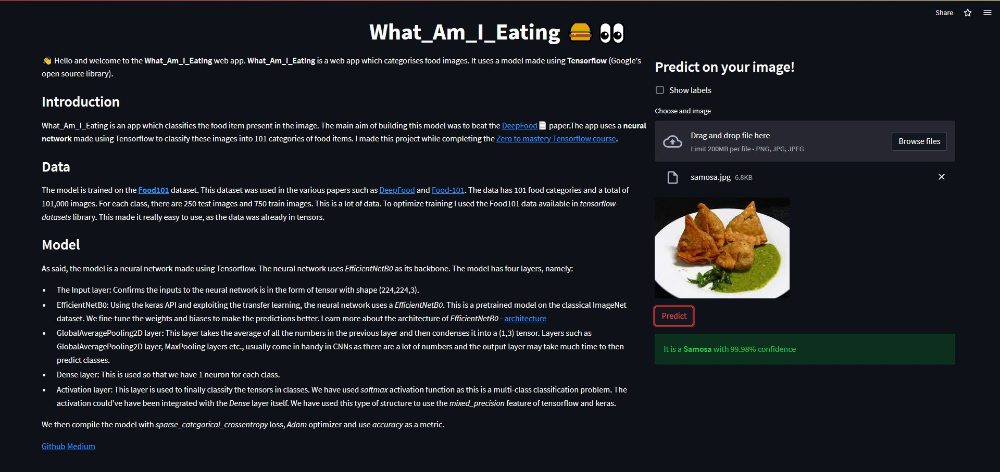

# What_Am_I_Eating Synopsis

[](https://colab.research.google.com/github/ishandandekar/What_Am_I_Eating/blob/main/notebooks/make_the_batter.ipynb)

<p align="center">
    
</p>

Hello and welcome to **What_Am_I_Eating**. What_Am_I_Eating is my first computer vision project (get the meme now? the meme has vision in it and vision is also a computer, so "computer vision").
Check out the [Medium](https://medium.com/@ishandandekar/foodvision-3843f38be45e) article as a supplement to this README. Check the [Website](https://what-am-i-eating.streamlitapp.com/)!

<p align="center">
    
</p>

## Introduction

**What_Am_I_Eating** is an app which classifies the food item present in the image. The main aim of building this model was to beat the [DeepFood](https://arxiv.org/abs/1606.05675)📄 paper. The app uses a neural network to classify these images into 101 categories of food items. I made this project while completing the [Zero to mastery Tensorflow course](https://zerotomastery.io/courses/learn-tensorflow/).

While doing this project I learned the various techniques and processes. I learned how to get preprocessed data using `tensorflow-datasets` library, how we can leverage other pre-trained models using _transfer learning_, how we can fine-tune these pre-trained models using _fine tuning_ method. I also understood the importance of _data augmentation_ and how it helps the model generalize better.

## Data

The model is trained on the **[Food101](https://data.vision.ee.ethz.ch/cvl/datasets_extra/food-101/)** dataset. This dataset was used in the various papers such as [DeepFood](https://arxiv.org/abs/1606.05675) and [Food-101](https://data.vision.ee.ethz.ch/cvl/datasets_extra/food-101/). The data has 101 food categories and a total of 101,000 images. For each class, there are 250 test images and 750 train images. This is a lot of data. To optimize training I used the Food101 data available in _tensorflow-datasets_ library. This made it really easy to use, as the data was already in tensors.

> **Note** : You can also find the dataset on **Kaggle** ([link](https://www.kaggle.com/datasets/dansbecker/food-101))

## Model

<p align="center">
    
</p>

The model uses transfer learning to use the **EfficientNetB0** architecture under the hood. The model has **five** layers, namely:

- **Input layer**: This layer confirms that the inputs to the neural network is in the form of tensor with shape (224,224,3).
- **EfficientNetB0**: Using the keras API and exploiting the transfer learning, the neural network uses a EfficientNetB0 as its base model. This is a pretrained model on the classical ImageNet dataset. To make the model better adapt to data, I fine-tuned the weights and biases to make the predictions better. Learn more about the architecture of `EfficientNetB0` - [architecture](https://ai.googleblog.com/2019/05/efficientnet-improving-accuracy-and.html)
- **GlobalAveragePooling2D** layer: This layer takes the average of all the numbers in the previous layer and then condenses it into a (1,3) tensor. Layers such as GlobalAveragePooling2D layer, MaxPooling layers etc., usually come in handy in CNNs as there are a lot of numbers and the output layer may take much time to then predict classes.
- **Dense layer**: This is used so that we have 1 neuron for each class.
- **Activation layer**: This layer is used to finally classify the tensors in classes. We have used `softmax` activation function as this is a multi-class classification problem. The activation could've have been integrated with the `Dense` layer itself. The model is have used this type of structure to use the `mixed_precision` feature of tensorflow and keras.

The model used _categorical crossentropy_ to check the goodness of fit and used _Adam_ optmizer to update its weights and other parameters. The model achieved around **78% accuracy** on the test set.

## App

The web app is made using Streamlit. I chose this framework as it is very easy to make web apps with it and then deploy it. The website is accompanied by the model (in .h5 file format). This reduces the time taken to predict.

## Future development

Although this project is simple and easy to make, I really want to make a full-fledged app which shows information about the classes too! A diet recommender also seems like a great idea. I also paln to make more models for better accuracy, for example, to incorporate EfficientNetB3 or ResNets etc. I would also like to get the better model on cloud using AWS or GCP to use the mixed precision feature.

## Tools and libraries

- Python
- Jupyter notebook
- Tensorflow
- Keras
- Streamlit
- Git and Github

## Contents of the repository

```
What_Am_I_Eating/
├─ assets/
├─ models/
├─ scripts/
├─ notebooks/
├─ LICENSE
├─ README.md
├─ requirements.txt
```

- _assets_ : This folder contains images and other unecessary files, which are either required by the app or the Medium article
- _models_ : Contains models made for the project and classification. `fine_tuned_model_with_model_ckpt_wo_mp.h5` is used for the streamlit app. The original model is `fine_tuned_model.h5`, but as Streamlit does not support mixed precision feature (Tensorflow utility), I made another model which does not use this.
- _scripts_ : Constains all the python scripts helpful for the project. This also contains the app script used for productionizing the project.
- _notebooks_ : Contains jupyter notebooks used for this project. The notebook contains analysis of the dataset and the modelling experiments performed.
- _requirements.txt_ : As the convention goes, this file has information about the `conda` environment used to create this project.

> **Note** : If you wish to replicate this project, use this `requirements.txt` file to create the python environment. This file was used to create the app environment too. Due to which I had to omit certain librabries. while making the environment, make sure to uncomment line 98 and 99. These libraries make help python run on Windows.

If you encounter any errors in the website, please make sure to add the error in the Issues tab of Github repository.

A special thanks to [Daniel Bourke](https://www.mrdbourke.com/) for this project.
